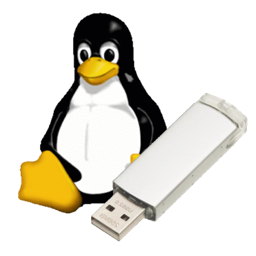

Mac Linux USB Loader
====================

Tool allowing you to put a Linux distro on a USB drive and make it bootable on Intel Macs using EFI.

General Information
-------------------

This is the Mac Linux USB Loader, a tool allowing you to take an ISO of a Linux distribution and make it boot using EFI. It requires a single USB drive formatted as FAT with at least 2 GB free recommended. Mac Linux USB Loader is available under the 3-clause BSD license.

The tool is necessary to make certain Linux distributions boot that do not have EFI booting support. Many distributions are adding this with the release of Windows 8, but it has not been finalized and is still nonstandard by most distros. Many common distributions are supported, like Ubuntu and Linux Mint.

If you wish to contribute to the code or fork the repository, please do so. All development currently takes place on the _master_ branch, and this is where code should be submitted for pull requests. The _legacy_ branch contains the code for pre-3.0 versions of Mac Linux USB Loader; it will not be maintained and is present for historical interest only.

I created this tool, if you care, for several reasons:

- None of the other tools available (esp. unetbootin) feel native and operate as you would expect on the Mac platform.
- None of the other methods of which I am aware have the ability to make the archives boot on Intel Macs.
- It was personally a pain in the neck getting Linux distros to boot via USB on Macs.

That being said, it does have a few shortcomings:

- Linux fails to have graphics on some Macs (i.e Macbook Pros with nVidia graphics), which in some cases prevents boot, but this is not necessarily an issue with Mac Linux USB Loader as much as it is an issue with the video drivers that ship with most distros. Luckily, with Enterprise, which has been included with Mac Linux USB Loader since 2.0, you can use persistence to install the necessary video drivers on distributions like Ubuntu, helping to alleviate the issue.

Building from Source
--------------------
Requirements: Xcode 6, OS X 10.10 SDK. OS X 10.8+ required to run built app

1. Clone from git:
    `git clone https://github.com/SevenBits/Mac-Linux-USB-Loader.git`
1. Run `pod install` (requires [Cocoapods](http://cocoapods.org)).
1. Open `Mac Linux USB Loader.xcworkspace` and do an archive build, or simply run and debug it with Xcode

Acknowledgements
----------------

- Used some icons from KDE's Oxygen.
    [link](http://www.oxygen-icons.org/)
